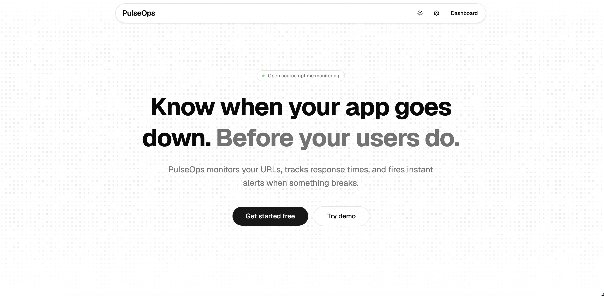
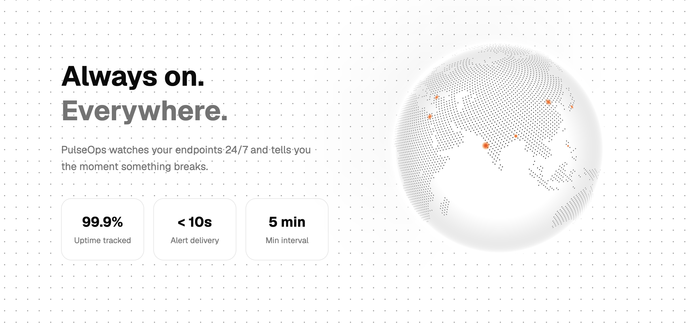
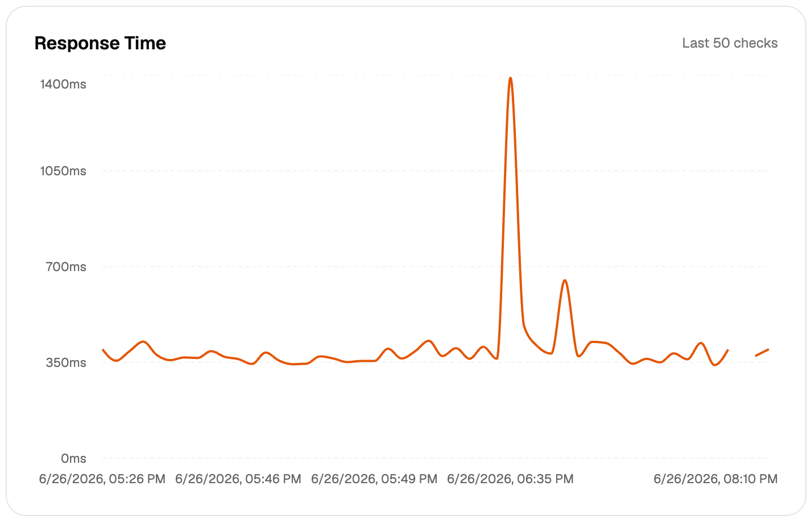

# PulseOps 

_in short : A platform to see if your site is up and running or not :)_


## Overview

Pulseops is a fullstack project to help to track down site uptime and downtime. It supports live monitoring dashboard, instant alerts, response time charts, manual health checks, jwt secure signin. User can also add team members and give them roles (i.e Admin, Member). User can create a public endpoint where general audience can monitor their data in a good ui :)



## Motivation 

This is one of the projects that I wanted to make with express. When this idea came to my mind I thought it will be to easy but I was a bit wrong! It was a great challenge to build it and that challenge motivated me :) 

## What can I doo ?

It's a tracking app so when you enter your site, the server will ping your site every according to your set time. It will ping and see if your site is active or not! If your site is found not acitve (Error) then it will send you email and log it in db, even if the site is active the site will keep your logs and present like the graph shown below 



## App Flow 

1. User signsup or login to the app
2. User assigns his site in /dashboard
3. The backend scans the db for timing and pings 
4. The backend puts the output it got from scanning to the db
5. The user can view the data from /:id/monitor (the frontend ask for data from backend)
6. Backend immediately sends email if site is found down

## Folder Structure 


```text
pulseops/
├── backend/
│   ├── drizzle/
│   └── src/
│       ├── controllers/
│       ├── db/
│       ├── lib/
│       ├── middleware/
│       ├── routes/
│       └── services/
├── frontend/
│   ├── public/
│   └── src/
│       ├── assets/
│       ├── components/
│       │   └── ui/
│       ├── context/
│       ├── hooks/
│       ├── lib/
│       └── pages/
├── pictures/
└── README.md
```

## Tech Used

### Backend (Express api)

- Runtime: Nodejs
- Framework/Library: Express
- ORM: Drizzle
- Database: Postgres
- Security: JWT

### Frontend 

- Framework: React
- Build Tool: Vite
- Styling: Tailwind CSS
- Ui library: shadcn/ui 
- Http Client: Axios

## AI Usage 

- Backend: All written by me, no ai 

- Frontend:
    - Used Ai to build some pages 
    - Helped me to debugged
    - Reviewed frontend code

- I used Ai for deploying it in vps

**NOTE**
```
- Used shadcn components
- Used magic-ui components for landing page
```

## How to Use

### Backend Setup 

1. Clone repo and go inside repo

``` bash 
git clone github.com/rusilkoirala/pulseops
cd backend 
```
2. Add .env secrets 

``` bash 
cp .env.example .env
```

3. Install dependency and run it 

``` bash 
cd backend && pnpm install && pnpm start
```

### Frontend Setup (in another terminal open)

1. Go inside frontend folder

2. Add .env secrets 
``` bash 
cp .env.example .env
```

3. Install Dependencies and Runn
``` bash 
pnpm install && pnpm dev
```


## Thank youu :)